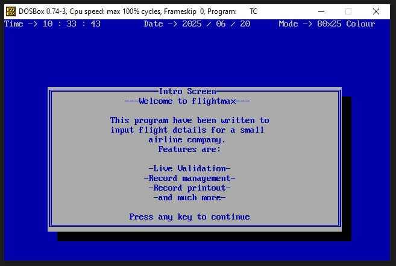

# Flightmax

C++ project compiled with Borland Turbo C++ 3.x (DOS)



## How to Setup

I have included the Borland C++ IDE in the `TC` folder.

### Prerequisites
Download and open DOSBox (https://sourceforge.net/projects/dosbox/)


### Open DOSbox
 In DOSBox : NB!! DOSbox might shorten paths such that Flightmax is Flight~1
	```
	mount c: c:\<git_checkout_path>
	```
 Run the setup batch file in command line to set Libraries and Include files as system paths:
	```
	setup.bat
	```
 Navigate and open Borland C++ 
	```
	c:\TC\BIN\TC.EXE   
	```

### In Borland C++ IDE
1. Navigate to **(P)Project** and browse to `Flightmax\PROJ6B.PRJ`
2. Navigate to **(C)Compile** > **(B)Build all**
3. Navigate to **(R)Run**

## Added Bonus
**SNAKE2.EXE** - A bonus snake game!
- **E** = up
- **D** = right  
- **X** = down
- **S** = left

---

*A nostalgic trip back to DOS-era C++ development!*
